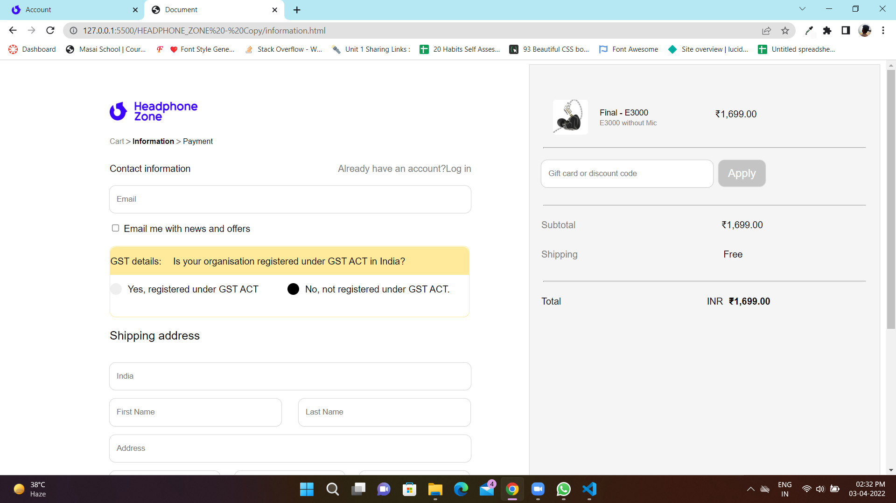

<h1>Headphonezone clone</h1>

HeadphoneZone is a global leading direct-to-consumer online retailer,"It’s hard to believe its been 10 years since Headphone Zone first opened its doors. It’s not a short amount of time. Even after a decade, I still wake up every morning as excited as ever to go to work and continue doing what I know best. I guess thats how you know your doing something right. If you're reading this page, then you've probably had a big role in the story of Headphone Zone. I thank you for joining me for the ride."

<h1>About our Project</h1>
 
We try to build the clone of HeadphoneZone website,Masai School gives us this opportunity to explore in a construct week

 
This is the final product link :--

 <h2>Our teammates</h2>
 <li>Brajkishor Singh Tomar</li>
 <li>Suresh Jungade</li>
 <li>Ashutosh Vishwakarma</li>
 <li>Gaurav Jaiswal</li>
 <li>Yash Gupta</li>
 <li>Arjun Rao</li>
  
 <h2>Tech Stacks We Used</h2>
 <li>HTML</li>
 <li>CSS</li>
 <li>javascript</li>
 <li>Bootstrap</li>
   
 <h2>Some Features </h2>
 
We are tried to build basic features a shopping websites need 

 
 <li>Home page have all the child pages</li>
 <li>Use Navbar to navigate through pages</li>
 <li>Rgistration page to sign in page is so smooth </li>
 <li>Vary easy to use </li>
 <li>You can increse or decrease quantity of products in cart page  </li>
 <li>Checkout page is secure and use vary less information of yours</li>
 

 <h2> screenshoots of web pages</h2>
  
 
Home page

 
  
  
 
Product page

 
  
  
 
Sign in page

 
  
  
 
Cart page

 
  
  
 
Checkout page

 
 
 
Checkout page

 
  
  

 
Footer section

 
  

 <h2>Learnings</h2>
 <li>How team works in colabrative manner</li>
 <li>Working under extreme presure</li>
 <li>If situation is not in your favour how to deal with that</li>
 <li>And lot's of tricks and DOM related concepts </li>
    

<h2> Team Contribution </h2>

All team members are good they do their works 
# HeadphoneZone-clone